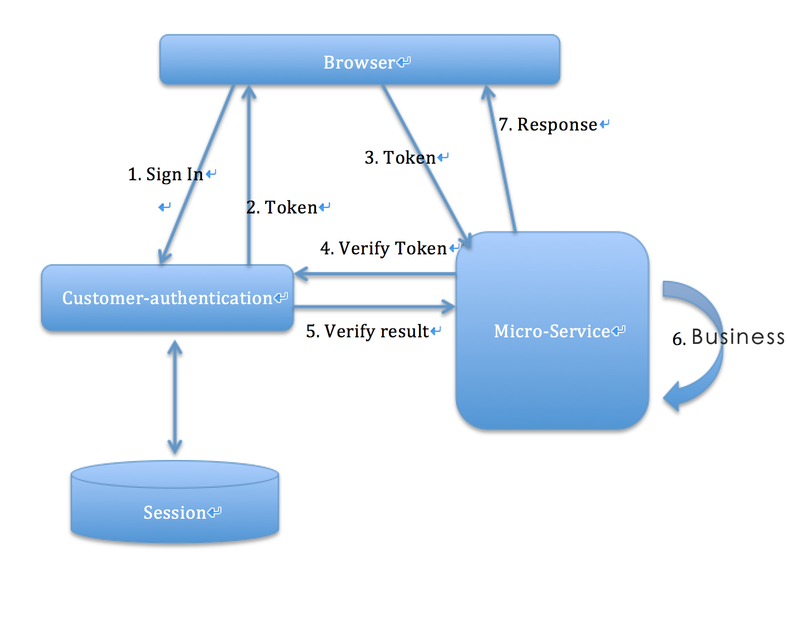

# admin-authentication
Used for admin authentication.

# 1 Introduction
admin authentication service, provide: sign in, sign up, sign out, generate admin token.

# 2. Build & Run
## 2.1 Build
## 2.2 Run

# 3. Features
- Use JWT to generate admin token. and the token contains such messages:
```Json
{
  "tokenType" : "", // could be admin
  "subjectId" : "", // could be admin id
  "generateTime" : ,
  "expiresIn" : ,
  "scope" : ""// only keep basic scope, like read report
}
```
- The `SignatureAlgorithm.HS512` for sign the token
- All admin id will be generate here.
- Use session for main scope store. So we can change one admin's scope dynamic.
- When init the service, we init a super admin.
- The other account can only be create by the super admin.

# 4. Design


TODO: need a work flow about how to verify the token, and how to change the scope dynamic.

# 5. Dependency


