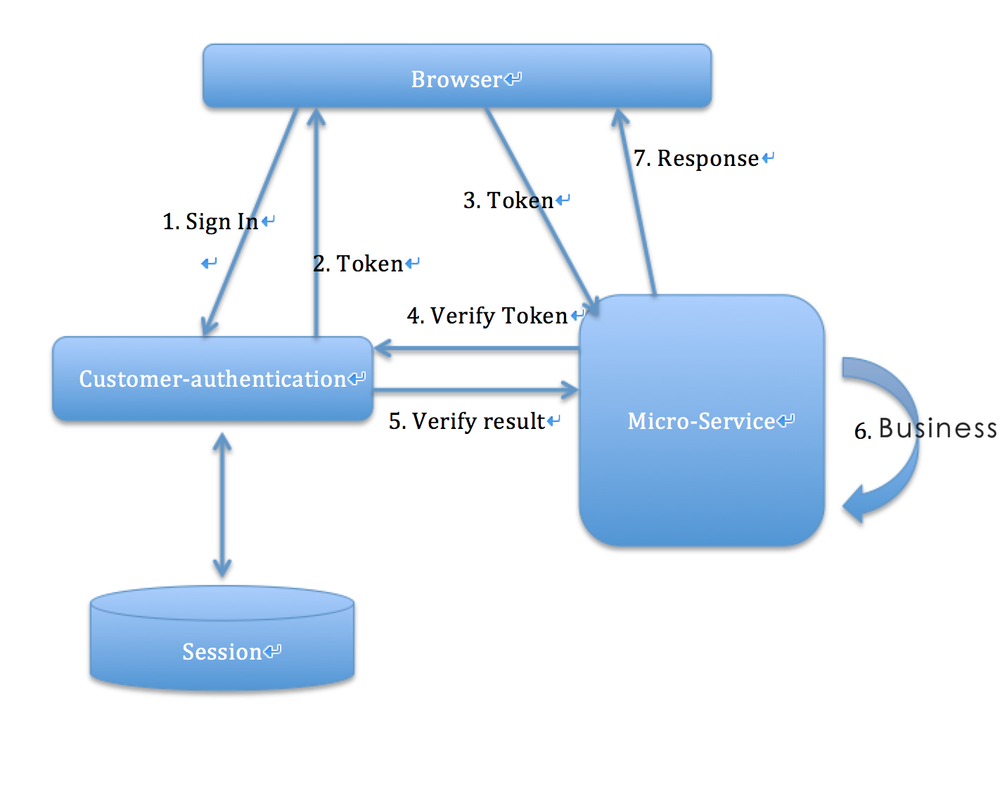

# Admin authentication
This doc describes the design of admin authentication service.

**Key Points**
- We separate our resource as models, like: product, category, inventory.
- We defines our permission with rules: `C` for `create`, `R` for `read`, `U` for Update, `D` for `Delete`.
- A scope contains a list of models, and a list of actions, meas that, the employee has those permissions on those models.
- A role contains a list of scopes.
- Each user of this service has a list of roles, so that the user can has those permissions contained in these roles.


## 1. Basic futures
- Add admin
- Add employee
- Login, Logout
- Check login status and permission
- Change password
- Reset employee's password
- Change employee's permission

## 2. Model design
- Entity: Admin
```java
  String id
  
  ZonedDateTime createdAt;

  ZonedDateTime lastModifiedAt;

  Integer version;
  
  String email;

  String password;
  
  List<String> roles;
```

- Entity: Role
```
  String id
  
  ZonedDateTime createdAt;

  ZonedDateTime lastModifiedAt;

  Integer version;
  
  String roleName;
  
  List<String> scopes;
```

- Entity: Scope
```
  String id
  
  ZonedDateTime createdAt;

  ZonedDateTime lastModifiedAt;

  Integer version;
  
  String scopeName;
  
  String permission;
  
  List<Model> models;
```

- Entity: Model
```java
  String id
  
  ZonedDateTime createdAt;

  ZonedDateTime lastModifiedAt;

  Integer version;
  
  String modelName;
  
  String path;
```

# 3. Detail design

## 3.1 Add admin
Just use super admin to post the data to the service, and then the admin will be created. When an admin be created, the `ADMIN` role will assigned to the user automatic.

## 3.2 Add employee
Just use admin to post the data to the service, and then the employee will be created. The roles can be post to the server together, or admin can assign roles to employee later.

## 3.3 Login
Use email and password to login to the admin system, and the server will keep the session.

## 3.4 Logout
When logout from the system, the session will be clear immediately.

## 3.5 Check login status and permission
Check if the user has login, and if he/she has the right permissions.

## 3.6 Change password
User can change his/her password with his/her old password.

## 3.7 Reset employee's password
Admin can reset employees's password.

## 3.8 Change employee's permission
Admin can change employee's permission, and the permissions in session will be changed at the same time.

# 4. Workflow
